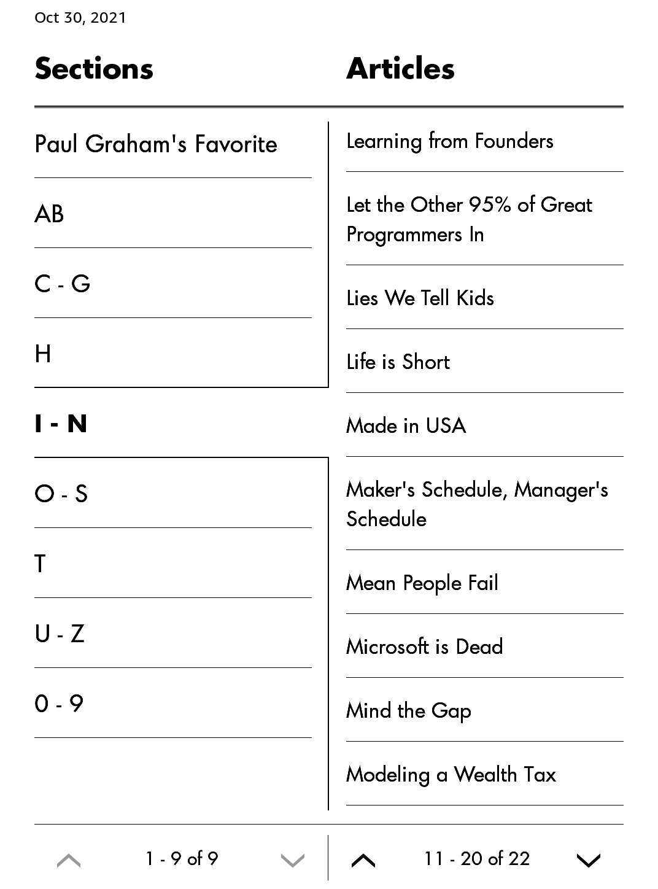

# Paul Graham博客合集

[English Version](Readme.md)

经典文章值得反复阅读，在网页上看太麻烦了，所以制作成了电子书。

网页爬到本地，制作电子书的时候又做了这些工作：

 - 设计封面
 - 网页由**cp1252**转码为**utf-8**，防止乱码
 - 添加**Favorite**、**Hackers and Painters**、**Latest**
 - 按照标题首字母分章节，方便查找
 - 添加非作者原创但在作者网站的几篇文章(Richard Hamming, Donald E. Knuth...)
 - 纠正正文中部分不对称的标点符号（破折号和引号）
 - 删除2个失效链接和1个年代久远内容过短的文章
 - 修正网页中不对称的tag，防止在Kindle上阅读出现异常

如果您熟悉Python和html，那么您可以通过编辑**calibre.recipe**或**index.html**添加或删除文章/章节，并按照以下步骤制作符合自己品位的kindle电子书：

## 1. 把本项目克隆到本地并启动 Web 服务器

```sh
git clone https://github.com/evmn/Paul-Graham.git
cd Paul-Graham
python -m http.server 8000
```

## 2. 测试程序

使用以下命令调试您的程序：

```sh
ebook-convert calibre.recipe .mobi --test -vv --debug-pipeline debug
```

## 3. 制作电子书

```sh
ebook-convert "calibre.recipe" .mobi \
        --authors="Paul Graham" \
        --title="Essays of Paul Graham" \
        --pubdate="2021-10-24" \
        --output-profile=kindle_pw3 \
        --mobi-file-type=new \
        -vv
```

## 4. 在Kindle、PC上阅读




## 已知Bugs

 - 脚注链接不正常

## 资源

 - [使用本项目脚本制作的最新版的Kindle电子书(本项目中的电子书可能不会及时更新)](https://t.me/master_thyself/285)
 - [Custom news fetching](https://blog.calibre-ebook.com/custom-news-fetching/)
