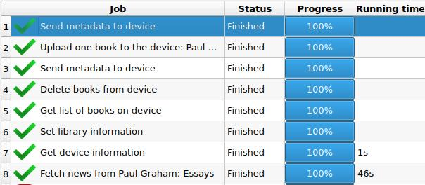
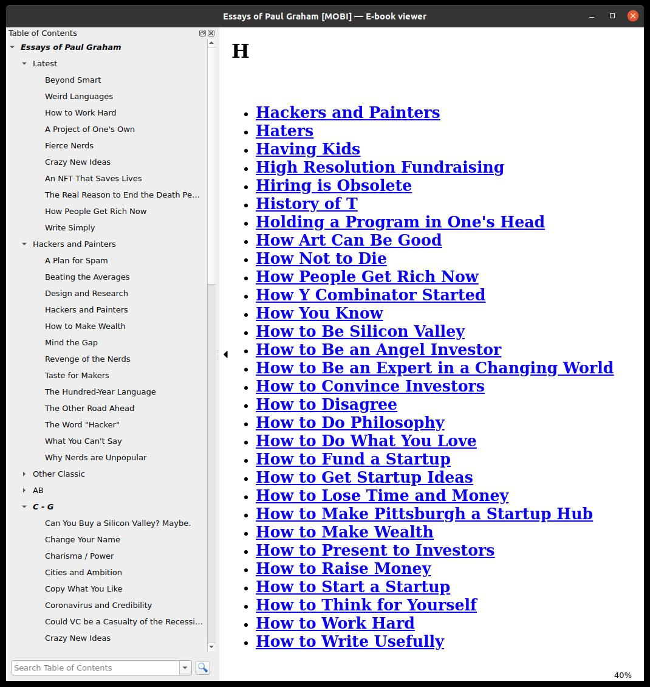
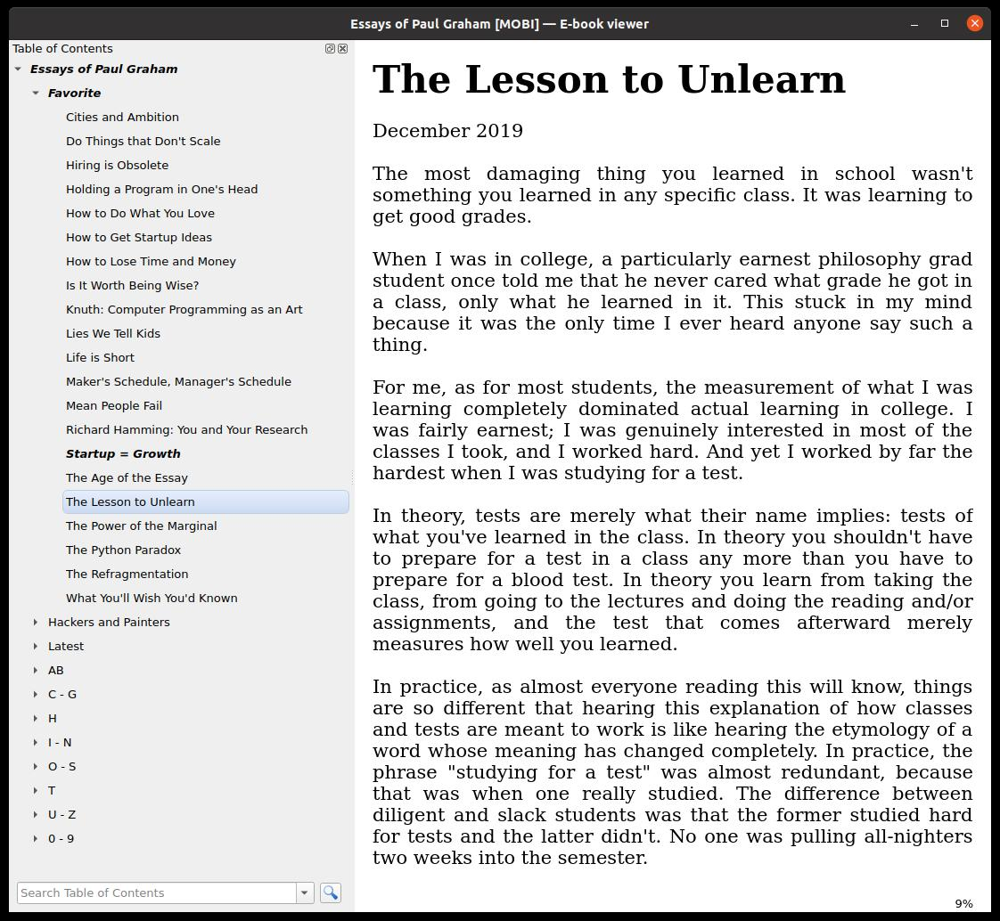

# Essays: Paul Graham

[中文版](Readme-CN.md)

After I crawled all the essays, I have done the following works:

 - Design book cover
 - Convert webpage encoding from **cp1252** to **utf-8** to prevent garbled characters
 - Added three chapters: **Favorite**, **Hackers and Painters**, **Latest**
 - Group essays alphabetically
 - Add a few articles that are not original written by the author but are on the author's website(Richard Hamming, Donald E. Knuth...)
 - Correct several punctuation mistakes (dashes and quotation marks) in the essays
 - Delete 2 broken links, remove 1 obsolete essay with too short content
 - Fix some unmatched tags in web pages to prevent text overflow on Kindles

If you are familiar with *python* and *html*, then you can add or remove essays/chapters easily! First, editing **calibre.recipe** or **index.html**, then follow the following steps:

## 1. Start a Local Web Server

Clone this repo to your computer and run the following command in current folder: 

```sh
python -m http.server 8000
```

## 2. Test recipe

Debug your recipe with the following command:

```sh
ebook-convert calibre.recipe .mobi --test -vv --debug-pipeline debug
```

## 3. Scrap with Calibre

Open Calibre, right click **Fetch news**, then choose **Add or edit a custom news source**, click **New recipe**, then **Switch to advanced mode** and paste your recipe there, then click **Save** and choose **Download this recipe**. It takes less than a minute to make a Kindle books with local server.

*You can also refer to this [demo video](https://t.me/master_thyself/293) in Telegram.*



## 4. Read on Kindle/PC






## Resource

 - [Latest E-Book Generated with the Latest Recipe(the E-Book in this repo is obsolete)](https://t.me/master_thyself/285)
 - [Demo video of download custom recipe with Calibre](https://t.me/master_thyself/293)
 - [Custom news fetching](https://blog.calibre-ebook.com/custom-news-fetching/)
